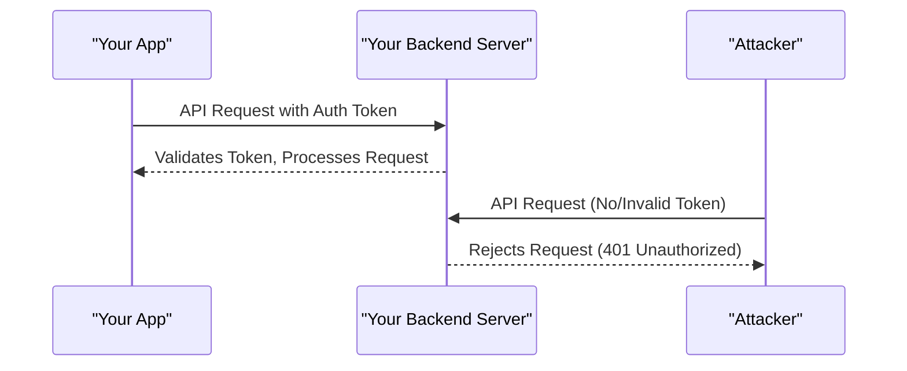

# Securing Your Backend API: Restricting Access to Only Your App

## Why Restrict Backend Access?
- Prevents unauthorized users from calling your backend APIs directly.
- Protects sensitive endpoints from abuse or data leaks.

## How to Restrict Backend Access to Only Your App

### 1. API Authentication (Best Practice)
- Require every API request to include a secure token (e.g., JWT, OAuth token, API key).
- Your app gets this token after a secure login or handshake.
- Backend checks the token on every request and rejects requests without a valid token.

### 2. App Attestation / Device Verification (Advanced)
- Use services like [Google Play Integrity API](https://developer.android.com/google/play/integrity) or [Apple DeviceCheck](https://developer.apple.com/documentation/devicecheck) to verify requests are coming from your genuine app on a real device.
- Backend verifies the attestation result before processing the request.

### 3. Network-level Restrictions (Limited Use)
- Restrict backend access to certain IP ranges (not practical for mobile apps, as user IPs change).
- For web apps, you can use CORS to restrict which domains can call your API, but this is not foolproof.

### 4. Obfuscation (Not Secure Alone)
- You can hide your API endpoints, but this is not real security—just makes it harder to find.

---

## Typical Secure Flow

---

## Summary Table

| Method                | Mobile App | Web App | Security Level | Notes                        |
|-----------------------|------------|---------|---------------|------------------------------|
| API Key/JWT           | ✅         | ✅      | Good          | Must keep keys secret        |
| Device Attestation    | ✅         | ❌      | Very High     | Harder to bypass             |
| CORS                  | ❌         | ✅      | Medium        | Not foolproof                |
| IP Whitelisting       | ❌         | ✅      | Low           | Not for mobile users         |

---

## Recommendations
- **Always use authentication tokens (JWT, OAuth, etc.)**
- For extra security, use device attestation if possible (for mobile).
- Never trust the client—always validate on the backend. 